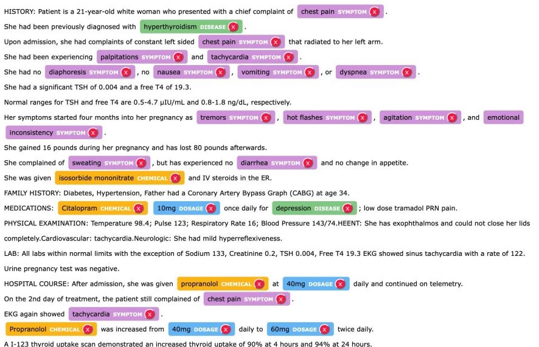
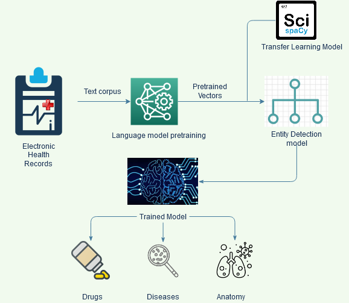

# Custom NER for Healthcare

## Problem Statement:
A dataset was provided containing a corpus of medical text. The text includes diseases and their treatments mentioned implicitly, making it difficult for a layperson to understand. For instance, "The patient was a 62-year-old man with squamous cell lung cancer, which was first successfully treated by a combination of radiation therapy and chemotherapy." Here, the patient is said to have cancer that was treated using radiation therapy and chemotherapy.

To make this information accessible to everyone, the aim was to build a supervised Named Entity Recognition (NER) model. This model would learn to extract and display viable treatment options for a given disease, making it easier for people to understand and access relevant medical information.

<table>
  <tr>
    <td></td>
    <td></td>
  </tr>
</table>

## Table of Contents
- [General Information](#generalinfo)
- [Technologies used](#datasets)

## General Information
- Data preprocessing
- Concept identification
- Defining the features for CRF
- Getting the features words and sentences
- Defining input and target variables
- Building the model
- Evaluating the model
- Identifying the diseases and predicted treatment using a custom NER

## Technologies used
- SpaCy
- sklearn-crfsuite
